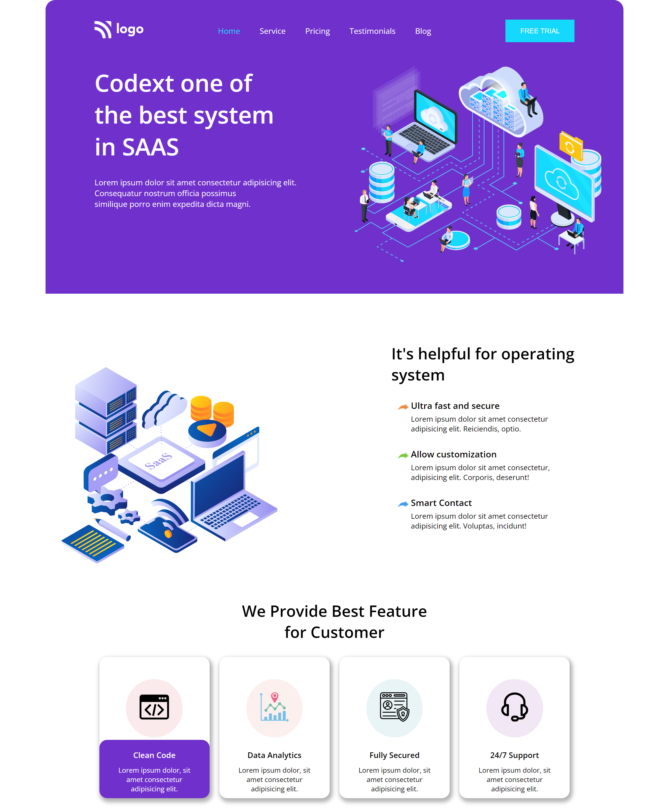

# Saas Landing Page [](http://www.gnu.org/licenses/agpl-3.0) [](http://www.gnu.org/licenses/agpl-3.0)

This is the home page of SAAS provider website.

## 🛠 Technologies Used

- HTML5 - Hyper Text Markup Language
- CSS3 - Cascading Spread Sheet

## Demo



## Run Locally

Clone the project

```
  git clone https://github.com/rakshitkoyani/SAAS-landing-page.git
```

Go to the project directory

```
  cd SAAS-landing-page
```

## Author

- [Rakshit Koyani](https://www.github.com/rakshitkoyani)
  - [](https://www.linkedin.com/in/rakshit-koyani-507040132/)
  - [](https://www.instagram.com/rakshitkoyani/)
  - [](https://www.twitter.com/rakshit_koyani)

## What I have learnt in this project

1. I learn about the element's border background and also practice the box shadow.

## Honest Time to finish the project

It takes me around 4 hours to complete me this project.

## Live link of the project

https://rakshitkoyani.github.io/SAAS-landing-page
